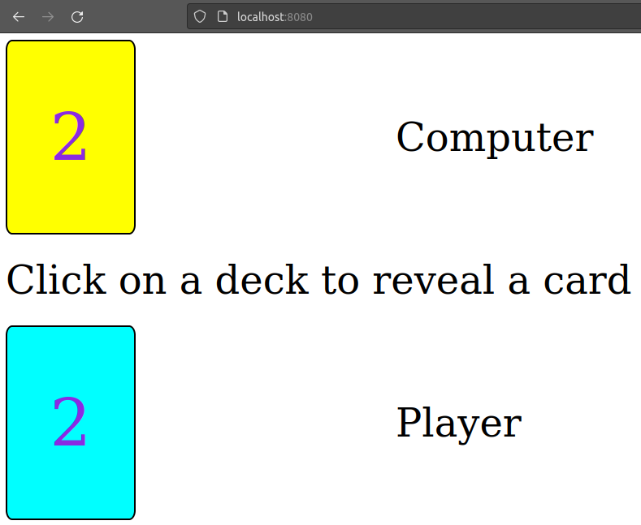
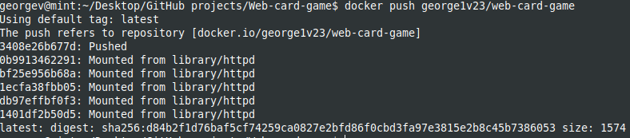

# Docker image for running a simple web application

The base image of my [Dockerfile](Dockerfile) is the Apache HTTP server project *httpd* from which is created the base. There are copied the necessary web application files from local host into the working directory created inside the container.

[.dockerignores](.dockerignore) ignores unnecessary files to be copied from local directory that contains the web-card-game when building the image.

The Docker image is build by using image httpd, then adding the files from local environment to run website application. Then run a container from the built image by exposing port 8080 externally and mapping to port 80 inside the container.  

`
docker build . -f Docker/Dockerfile -t web-card-game
`

`
docker run -d -p 8080:80 --name web-card-game web-card-game:latest
`

By accessing from web browser with localhost and port created (*http://localhost:8080*), we can see Apache httpd serves the html webpage of my app:

Then I pushed in my [DockerHub](https://hub.docker.com/) the image created: 
`
docker tag web-card-game:latest george1v23/web-card-game
`

`
docker push george1v23/web-card-game
`
