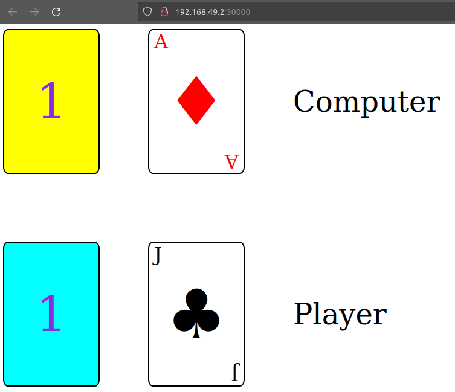

# Simple web application deployment with Kubernetes

1. Install Docker for container management to allow to start a K8s cluster using the docker driver

2. Install Minikube and Kubectl

3. Start a local Kubernetes cluster, that pulls a base image, then creates a docker container from it (allocating for it 2 CPUs cores and 2200MB RAM memory) and runs the container:

`minikube start --driver=docker`  
`minikube status` -> get the status  

`kubectl get nodes` -> verify the nodes (needs to apear minikube)  
`kubectl get services` -> verify the services  
`kubectl cluster-info`

## [Deployment](/deployment.yml)

Deployment is an abstraction layer over the pods. Pod is the smallest unit of K8s cluster. We are not working with the pods directly, we use deployment that creates the pods underneath.

In the specification of deployment yaml file I set to be created 3 replicas of pods, but one of it is pending because of the limits of resources allowed to run I setted.

## [Service](/service.yml)

Service points to the Pods directly and skips the Deployment altogether. It finds the pods that is gonna attach to using the selector field in yaml to connect to pod through label. Also, in yaml configuration file we need to set the service/host port to be exposed and the target port to match the container port of deployment.

In my yaml file for service, I put the option to automatically create a cloud load balancer. This provides an externally-accessible IP address that sends traffic to the correct port on cluster nodes, given the fact that my cluster will run in a supported environment and is configured with the nginx server which provides load balancing.

After creating the deployment replicas pods over containers of my web application image is running in Minikube cluster. Now it is possible to access the webpage of my running app from by connecting with http to the IP of minikube with the node port set in the service yaml file:

`minikube ip` -> gets the ip

`http://192.168.49.2:30000/` -> address to connect to web-app

